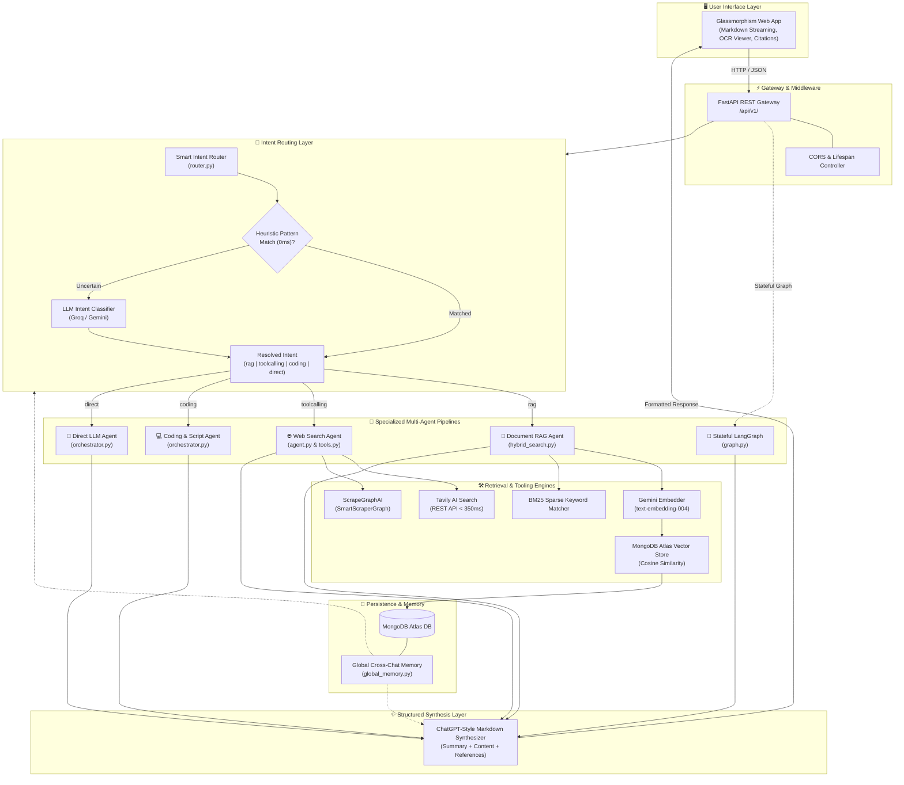
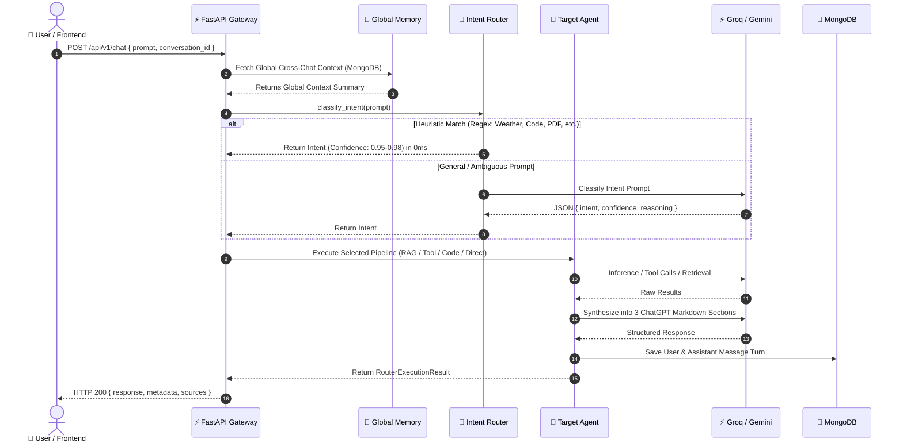
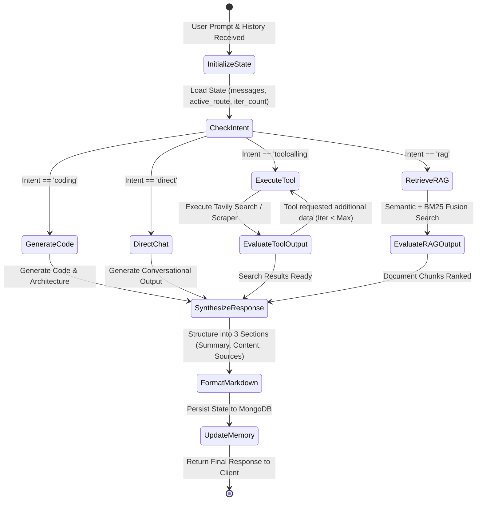
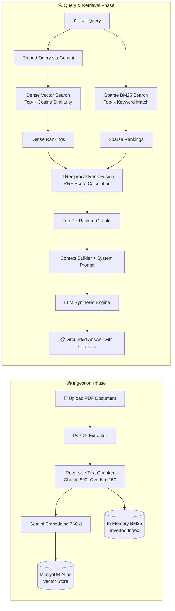
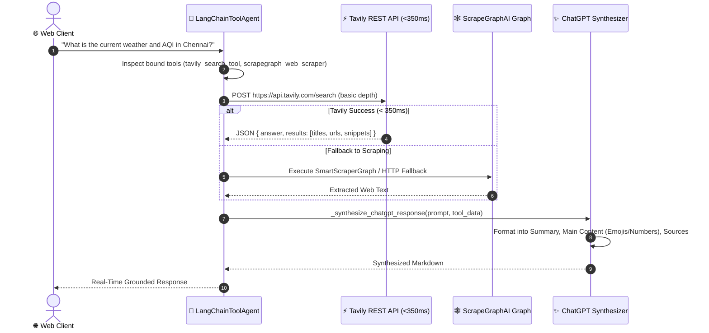
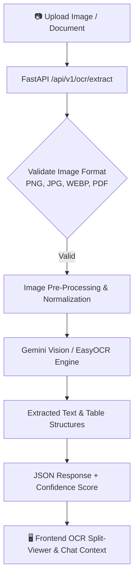
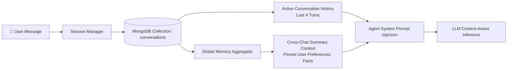

# 🤖 Multi-Agent AI System

<div align="center">


<br/>

**An enterprise-grade, high-throughput Multi-Agent AI platform combining Smart Intent Routing, Hybrid RAG (Semantic + BM25 + RRF), Real-time Web Intelligence, OCR Extraction, and Stateful LangGraph Workflows.**

*Developed by **Sachin***

</div>

---

## 📑 Table of Contents

- [Overview](#-overview)
- [System Architecture](#-system-architecture)
  - [Architectural Layers](#architectural-layers)
  - [High-Level Architecture Diagram](#high-level-architecture-diagram)
- [End-to-End Workflows](#-end-to-end-workflows)
  - [1. Intent Routing & Pipeline Dispatch Workflow](#1-intent-routing--pipeline-dispatch-workflow)
  - [2. Stateful LangGraph Cyclical Agent Workflow](#2-stateful-langgraph-cyclical-agent-workflow)
  - [3. Hybrid RAG (Dense + Sparse + RRF) Workflow](#3-hybrid-rag-dense--sparse--rrf-workflow)
  - [4. Ultra-Fast Web Intelligence & Tool Calling Workflow](#4-ultra-fast-web-intelligence--tool-calling-workflow)
  - [5. OCR Document Intelligence Workflow](#5-ocr-document-intelligence-workflow)
  - [6. Cross-Chat Memory & Session Persistence Workflow](#6-cross-chat-memory--session-persistence-workflow)
- [Key Features](#-key-features)
- [Agent Ecosystem & Routes](#-agent-ecosystem--routes)
- [Directory Structure](#-directory-structure)
- [API Reference](#-api-reference)
- [Environment Configuration](#-environment-configuration)
- [Getting Started](#-getting-started)
  - [Prerequisites](#prerequisites)
  - [Backend Setup](#backend-setup)
  - [Frontend Setup](#frontend-setup)
  - [Running via Docker](#running-via-docker)
  - [510 MB Deployment Packaging](#510-mb-deployment-packaging)
- [Tech Stack](#-tech-stack)
- [License](#-license)

---

## 🌟 Overview

The **Multi-Agent AI System** is a unified AI orchestration platform engineered to solve multi-modal enterprise tasks with low latency and high accuracy. It dynamically routes user requests to specialized autonomous sub-agents:

1. **📄 Document Agent (RAG)**: Ingests PDFs, chunks content, computes vector embeddings, and performs Reciprocal Rank Fusion (RRF) hybrid search across MongoDB Vector Store.
2. **🌐 Web Intelligence Agent**: Executes sub-second live web queries and weather forecasts using the Tavily Search REST API and ScrapeGraphAI.
3. **💻 Software Engineering Agent**: Handles programming, algorithm design, script generation, and code refactoring.
4. **👁️ OCR & Vision Agent**: Extracts and analyzes text and structures from scanned images and document uploads.
5. **💬 Direct Conversational Agent**: Delivers rapid general knowledge and multi-turn conversations.

All responses are synthesized into clean, structured **ChatGPT-style Markdown**:
- `### 📌 Question Summary`
- `### 💡 Main Content`
- `### 📚 Sources & References`

---

## 🏗️ System Architecture

### Architectural Layers

The system is organized into 5 modular, decoupled layers:

```text
┌─────────────────────────────────────────────────────────────────────────────┐
│ 1. PRESENTATION LAYER (Glassmorphism Dark-Mode UI / HTML5 / CSS3 / ES6+)    │
├─────────────────────────────────────────────────────────────────────────────┤
│ 2. API GATEWAY & ROUTING (FastAPI / CORS Middleware / Lifespan Manager)     │
├─────────────────────────────────────────────────────────────────────────────┤
│ 3. ORCHESTRATION & AGENT CORE                                               │
│    • Smart Intent Router (0ms Heuristic Regex + LLM Classifier)             │
│    • LangGraph Stateful Workflow (Cyclical State Graph & Condition Edges)   │
│    • LangChain Tool Calling Agent (Tavily REST + ScrapeGraphAI)             │
│    • Hybrid RAG Engine (BM25 Sparse + Dense Semantic + RRF Fusion)          │
│    • ChatGPT Structured Response Synthesizer                                │
├─────────────────────────────────────────────────────────────────────────────┤
│ 4. AI & LLM PROVIDERS                                                       │
│    • Groq Cloud (openai/gpt-oss-20b, llama-3.3-70b)                         │
│    • Google Gemini API (gemini-3.8-flash, gemini-3.5-flash)                 │
│    • Tavily AI Search Engine & ScrapeGraphAI Cloud                          │
├─────────────────────────────────────────────────────────────────────────────┤
│ 5. PERSISTENCE & DATA STORAGE                                               │
│    • MongoDB Atlas (Conversations, Chat Messages, Vector Chunks)            │
│    • Vector Index (768-dimensional Gemini Embeddings)                       │
│    • Document Upload Storage & In-Memory BM25 Corpus Index                  │
└─────────────────────────────────────────────────────────────────────────────┘
```

---

### High-Level Architecture Diagram



---

## 🔄 End-to-End Workflows

### 1. Intent Routing & Pipeline Dispatch Workflow

The request lifecycle executes with sub-millisecond heuristic classification before dispatching to the target pipeline:



---

### 2. Stateful LangGraph Cyclical Agent Workflow

The LangGraph engine maintains conversation states across multi-step execution graphs:



---

### 3. Hybrid RAG (Dense + Sparse + RRF) Workflow

The Document Intelligence engine indexes PDFs and performs hybrid rank fusion:

$$\text{RRF Score}(d) = \sum_{m \in M} \frac{1}{k + r_m(d)} \quad (k = 60)$$



---

### 4. Ultra-Fast Web Intelligence & Tool Calling Workflow

Optimized to return live internet intelligence in under 1.5 seconds:



---

### 5. OCR Document Intelligence Workflow



---

### 6. Cross-Chat Memory & Session Persistence Workflow



---

## ✨ Key Features

- **⚡ Sub-Second Latency Optimization**: Heuristic classification routes common intents (weather, news, code, documents) in **0ms** before invoking LLM fallbacks.
- **🔍 Hybrid Search with RRF**: Combines dense semantic vector retrieval with sparse BM25 keyword matching via Reciprocal Rank Fusion ($RRF$) for high RAG precision.
- **🌐 Real-Time Web Intelligence**: Fast REST search integration (< 350ms) using Tavily AI and deep web extraction via ScrapeGraphAI graphs.
- **🧠 Cross-Chat Session Memory**: Persistent conversation history stored in MongoDB Atlas with cross-chat global context awareness.
- **🖼️ OCR Document Intelligence**: Full OCR pipeline to parse uploaded screenshots, receipts, invoices, and PDF pages.
- **🎨 Modern Dark Mode UI**: Glassmorphism interface with real-time markdown streaming, code highlighting, copy widgets, citations, and OCR side panels.
- **📦 Cloud Deployment Optimized**: Pre-configured for containers and lightweight deployments under **510 MB**.

---

## 🤖 Agent Ecosystem & Routes

| Route | Trigger Keywords / Scenarios | Powered By | Output Format |
| :--- | :--- | :--- | :--- |
| **`rag`** | `pdf`, `resume`, `uploaded`, `document`, `file content` | MongoDB Vector Store + Gemini Embeddings | Document chunks, RRF rank, synthesized answer |
| **`toolcalling`** | `weather`, `latest`, `recent`, `news`, `today`, `stock`, `prices` | Tavily Search REST + ScrapeGraphAI | Live data, temperature, humidity, web citations |
| **`coding`** | `code`, `python`, `javascript`, `debug`, `fastapi`, `react` | Groq / Gemini Software Agent | Clean fenced code blocks with documentation |
| **`direct`** | General questions, casual conversation, greetings | Groq `openai/gpt-oss-20b` / Gemini `gemini-3.8-flash` | Direct conversational markdown |

---

## 📂 Directory Structure

```text
Multi-Agent/
├── Dockerfile                  # Multi-stage production container configuration
├── .dockerignore               # Container build exclusions
├── .gitignore                  # Git exclusions (.env, venvs, cache, etc.)
├── package_deploy.py           # Deployment compression script (< 510 MB)
├── backend/
│   ├── requirements.txt        # Python dependencies
│   ├── server.py               # Uvicorn entry point
│   ├── app/
│   │   ├── main.py             # FastAPI application gateway & CORS
│   │   ├── ai/
│   │   │   ├── agent.py        # LangChain tool calling agent & synthesis
│   │   │   ├── global_memory.py# Cross-chat MongoDB memory aggregator
│   │   │   ├── graph.py        # LangGraph stateful workflow definition
│   │   │   ├── orchestrator.py # Multi-agent orchestrator & pipeline dispatch
│   │   │   ├── router.py       # Heuristic & LLM smart intent router
│   │   │   └── tools.py        # Tavily, ScrapeGraphAI, & Vector tools
│   │   ├── core/
│   │   │   └── config.py       # Pydantic settings & model fallback tiers
│   │   ├── db/
│   │   │   └── __init__.py     # MongoDB Atlas client & health ping
│   │   ├── rag/
│   │   │   ├── embedder.py     # Gemini text embeddings
│   │   │   ├── hybrid_search.py# BM25 + Semantic + RRF hybrid engine
│   │   │   ├── pdf_loader.py   # PDF text extraction
│   │   │   ├── text_chunker.py # Recursive text chunking with overlap
│   │   │   └── vector_store.py # MongoDB Atlas Vector Search client
│   │   └── routes/
│   │       ├── agent.py        # Direct agent execution route
│   │       ├── chat.py         # Main chat endpoint with memory
│   │       ├── conversations.py# Session and history management
│   │       ├── langgraph.py    # LangGraph state machine chat route
│   │       ├── ocr.py          # OCR text extraction route
│   │       ├── rag.py          # RAG query and index endpoints
│   │       ├── router.py       # Intent classification endpoint
│   │       └── upload.py       # File upload and vector ingestion
└── frontend/
    ├── app.html                # Main web application interface
    ├── app.css                 # Glassmorphism dark mode stylesheet
    ├── app.js                  # Frontend state machine & API client
    ├── index.html              # Landing page
    ├── package.json            # Vite dev configuration
    └── script.js               # UI interaction handlers
```

---

## 📡 API Reference

### Core Endpoints

| Method | Path | Description |
| :--- | :--- | :--- |
| `POST` | `/api/v1/chat` | Primary chat endpoint with intent routing & session memory |
| `POST` | `/api/v1/router/execute` | Classifies prompt intent (`rag`, `toolcalling`, `coding`, `direct`) and executes |
| `POST` | `/api/v1/rag/query` | Directly queries vector store using Hybrid RAG Search |
| `POST` | `/api/v1/upload` | Uploads PDF documents, generates embeddings, and indexes chunks |
| `POST` | `/api/v1/ocr/extract` | Extracts text from uploaded image files |
| `POST` | `/api/v1/langgraph/chat` | Executes LangGraph state machine workflow |
| `GET` | `/api/v1/conversations` | Fetches conversation list and chat history |
| `GET` | `/health` | Health status and MongoDB Atlas connection ping |

---

## ⚙️ Environment Configuration

Create a `.env` file inside the `backend/` directory:

```env
# Google Gemini API
GEMINI_API_KEY="your-gemini-api-key"

# Groq API
GROQ_API_KEY="your-groq-api-key"

# Tavily AI Search (for ultra-fast real-time web intelligence)
TAVILY_API_KEY="your-tavily-api-key"

# ScrapeGraphAI (optional, for cloud-based scraping)
SGAI_API_KEY="your-scrapegraph-api-key"

# MongoDB Atlas Vector Store Configuration
MONGODB_URI="mongodb+srv://<username>:<password>@cluster.mongodb.net/?retryWrites=true&w=majority"
MONGODB_DB_NAME="multiagent_db"
MONGODB_COLLECTION_NAME="vector_chunks"
VECTOR_INDEX_NAME="vector_index"

# Model Tier Configuration
DEFAULT_MODEL="groq/openai/gpt-oss-20b"
```

---

## 🚀 Getting Started

### Prerequisites

- **Python 3.10+**
- **Node.js 18+** (for frontend development server)
- **MongoDB Atlas** cluster with Vector Search enabled

---

### Backend Setup

1. **Navigate to the backend directory**:
   ```bash
   cd backend
   ```

2. **Create and activate a virtual environment**:
   ```bash
   # Windows
   python -m venv venv
   .\venv\Scripts\activate

   # Linux / macOS
   python3 -m venv venv
   source venv/bin/activate
   ```

3. **Install dependencies**:
   ```bash
   pip install -r requirements.txt
   ```

4. **Start the FastAPI Server**:
   ```bash
   python server.py
   # Or using uvicorn directly:
   uvicorn app.main:app --host 0.0.0.0 --port 8990 --reload
   ```

   The backend API will be live at `http://localhost:8990`. Interactive API Docs are available at `http://localhost:8990/docs`.

---

### Frontend Setup

1. **Navigate to the frontend directory**:
   ```bash
   cd frontend
   ```

2. **Install dependencies & start the dev server**:
   ```bash
   npm install
   npm run dev
   ```

   Access the application UI at `http://localhost:5173`.

---

### Running via Docker

```bash
# Build the Docker image
docker build -t multi-agent-system:latest .

# Run the container
docker run -p 8990:8990 --env-file backend/.env multi-agent-system:latest
```

---

### 510 MB Deployment Packaging

For storage-constrained deployments (e.g. 512 MB limits), run the custom packaging script:

```bash
python package_deploy.py
```

This creates an optimized `deployment_package.zip` (under ~10 MB compressed) excluding heavy caches, virtual environments, and node modules.

---

## 🛠️ Tech Stack

- **Backend**: [FastAPI](https://fastapi.tiangolo.com/), [Pydantic v2](https://docs.pydantic.dev/), [Uvicorn](https://www.uvicorn.org/)
- **AI & Orchestration**: [LangChain](https://python.langchain.com/), [LangGraph](https://langchain-ai.github.io/langgraph/), [LiteLLM](https://litellm.ai/)
- **LLM Providers**: [Groq](https://groq.com/) (`openai/gpt-oss-20b`), [Google Gemini](https://ai.google.dev/) (`gemini-3.8-flash`)
- **Vector Database**: [MongoDB Atlas Vector Search](https://www.mongodb.com/products/platform/atlas-vector-search)
- **Web Search & Scraping**: [Tavily AI Search](https://tavily.com/), [ScrapeGraphAI](https://scrapegraphai.com/)
- **Frontend**: Vanilla HTML5, Modern CSS3 (Glassmorphism, Dark Mode), JavaScript (ES6+)

---

## 📄 License

This project is licensed under the MIT License. Developed with ❤️ by **Sachin**.